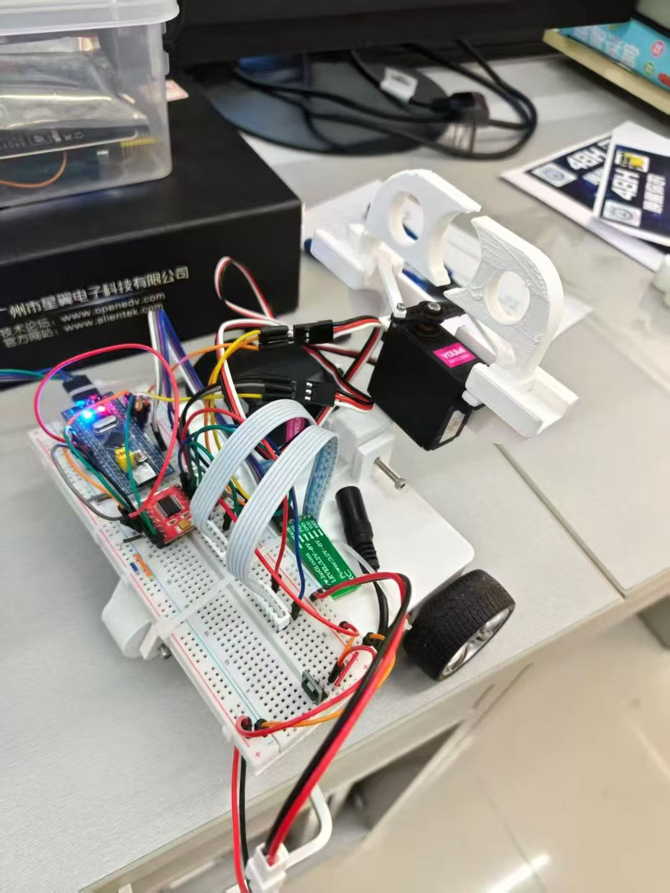
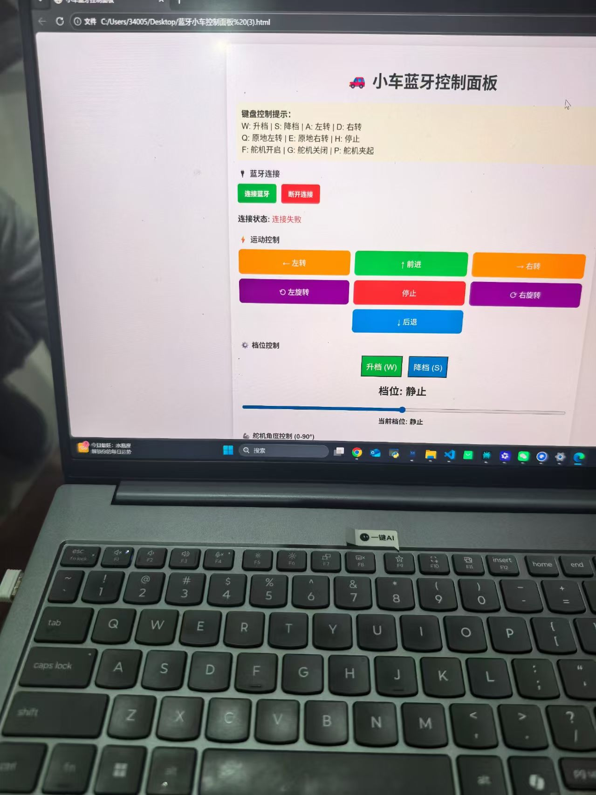

# Simple_Car - 基于 STM32 的蓝牙遥控多功能小车

##  项目简介
本项目是一个集运动控制、远程通信、机械臂控制于一体的嵌入式控制系统。旨在通过蓝牙无线操控，实现小车在复杂场景下的灵活移动及物体抓取任务。该项目作为校内机器人竞赛的基础原型，展示了 STM32 HAL 库开发的核心流程及模块化驱动设计思想。

##  技术栈
- **核心芯片**: STM32F103C8T6 
- **软件库**: STM32CubeMX + HAL 库 (High Abstraction Layer)
- **开发工具**: CLion + CMake + VSCode
- **通信协议**: UART (串口通信) + Bluetooth
- **关键技术**: 
  - **DMA  中断**: 实现高效、不占 CPU 资源的蓝牙指令接收。
  - **PWM (脉宽调制)**: 用于直流电机调速及舵机角度精准控制。
  - **有限状态机 (FSM)**: 规范系统运行状态，确保指令响应的鲁棒性。

##  核心功能
### 1. 运动控制系统
- 支持前进、后退、差速左/右转、原地 360° 旋转。
- 通过 PWM 调节占空比实现无级调速。

### 2. 机械臂控制系统
- **抬升机构**: 控制舵机实现 0° - 135° 的俯仰动作。
- **夹爪机构**: 精准控制夹爪开合，支持特定角度的夹取与释放。

### 3. 通信与解析系统
- 采用 **"指令+参数"** 的自定义通信协议（如 `F500` 前进，速度 500）。
- 接收端采用 `UARTEx_ReceiveToIdle_DMA` 机制，配合字符串解析算法实现低延迟响应。

## 📡 蓝牙控制协议 (示例)
| 指令码 | 含义 | 参数范围 | 示例 |
| :--- | :--- | :--- | :--- |
| `F` | 前进 | 0 - 1000 | `F500` |
| `B` | 后退 | 0 - 1000 | `B500` |
| `X` / `Y` | 原地左/右旋 | 0 - 1000 | `X600` |
| `O` / `C` | 机械臂开/关 | 0 - 90 | `O45` |
| `P` | 夹取/释放切换 | 0 - 90 | `P60` |
| `H` | 紧急制动 | N/A | `H` |

##  项目结构说明
- `Core/Src/motor.c`: 电机驱动封装（正反转、速度设置）。
- `Core/Src/BlueeTooth.c`: 通信解析核心逻辑及 DMA 回调处理。
- `Core/Src/sevro.c`: 舵机 PWM 控制及角度映射逻辑。
- `Core/Src/main.c`: 状态机调度与系统初始化。

---

##  项目展示

| 小车实物 | 蓝牙控制界面 |
| :---: | :---: | :---: |
|  |  | 

